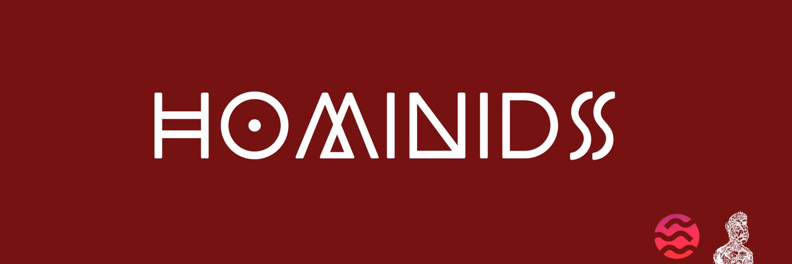

# 📢 Hominids

<figure><figcaption></figcaption></figure>

<mark style="color:blue;">**Hominids**</mark> brings significant value to the Web3 community by providing collaboration opportunities, tools and resources, driving on <mark style="color:blue;">**blockchain**</mark> adoption, encouraging experimentation and innovation, and providing technical support and expertise.&#x20;

We strongly believe that the success and growth of the Web3 community relies on collaboration and mutual support, and we are committed to actively contributing to this vibrant ecosystem. Hominids benefits the Web3 community as a whole by providing new opportunities and driving adoption of blockchain technology. More specifically, other developers can benefit in several ways:

&#x20;  🔹 <mark style="background-color:blue;">**Collaboration and partnerships**</mark>: _Hominids encourages collaboration with other developers in the Web3 community. We offer partnership opportunities to create joint decentralized applications, explore new features and develop innovative projects together._

&#x20;   🔹 <mark style="background-color:blue;">**Access to tools and resources**</mark>: _Our team is well-versed in the **MORE programming language used in the  blockchain**, which means we can provide guidance, code examples, and resources to help other developers create and deploy smart contracts and applications on the blockchain._

&#x20;  🔹 <mark style="background-color:blue;">**Boosting Sui blockchain adoption**</mark>: _By providing immersive experiences, compelling features, and a range of products and services, Hominids is helping to bring attention to blockchain and encourage adoption by a wider audience. This creates a positive dynamic for other developers who want to work on blockchain, as it provides them with a strong user base and opportunity._

&#x20;  🔹 <mark style="background-color:blue;">**Experimentation and innovation**</mark>: _Hominids is open to experimentation and innovation in NFT, games, and decentralized applications. By working with us, other developers can explore new ideas, test concepts and push the boundaries of what is possible on the blockchain. This fosters creativity and technological advancement within the Web3 community._

&#x20;  🔹 <mark style="background-color:blue;">**Technical support and expertise**</mark>: _Our team is available to provide technical support and expertise to other developers. Whether it's solving problems, answering questions, or offering advice, we are here to help other developers overcome obstacles and succeed in their projects._

<mark style="color:blue;">**HOMINIDS**</mark> is a groundbreaking project that combines the power of **NFTs**, blockchain and metaverse to create an unparalleled immersive experience. Our goal is to push the boundaries of creativity, social interaction and technological innovation.

We have created a multi-token marketplace with **0% transaction fees**, allowing users to buy, sell and discover a multitude of unique and valuable NFTs. With our Dapp-Marketplace <mark style="color:purple;">era-homi.xyz</mark>, you can access a wide range of hominid NFTs, each representing a unique anthropomorphic character with its own **unique traits, personality and characteristics.**

But HOMINIDS doesn't stop there! We are also developing our own **mobile metaverse using Unreal Engine 5.1.** This metaverse will be connected to our **Dapp-Marketplace**, offering a seamless and immersive experience. You will be able to explore virtual worlds, interact with other users and participate in exciting social and entertainment activities.\

In addition to this, we have **many exciting projects in development**. We are working on the TraitStore, where NFT owners will be able to trade, buy and sell specific traits to customize their NFTs. We also plan to launch a second exclusive collection with advanced features such as wagering and cashback, allowing NFT owners to earn rewards in $HOMI tokens and cashback on transactions made on our platform.\

The security and satisfaction of our community is paramount to us. We are committed to **KYC (Know Your Customer) checks to ensure transparency and security for NFT holders**. In addition, we plan to list our **$HOMI token** on a **CEX and DEX**, which will allow us to reach a wider audience and facilitate trading.

\

\
