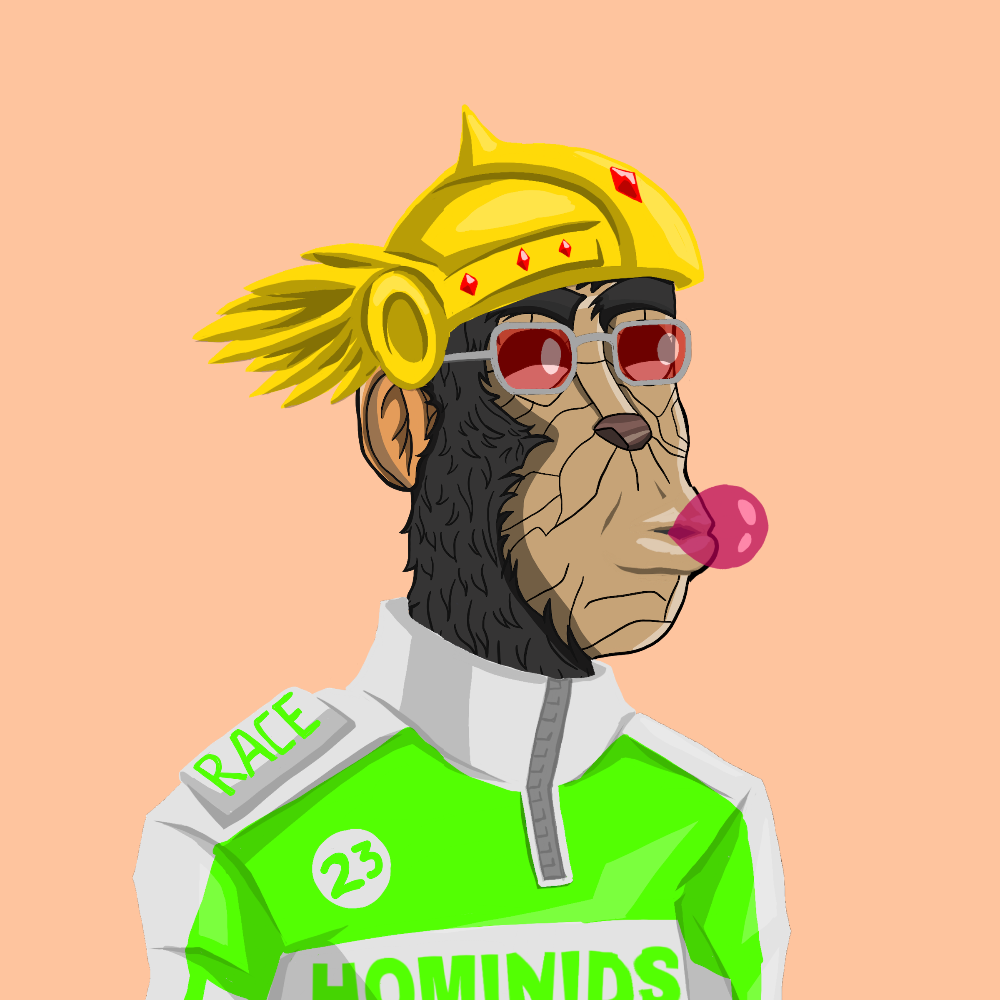

# 🔹Gen 1 : 1017 NFT

<figure><figcaption></figcaption></figure>

 

<figure><figcaption></figcaption></figure>

 

<figure><figcaption></figcaption></figure>

 

<figure><figcaption></figcaption></figure>

 

<figure><figcaption></figcaption></figure>

 

<figure><figcaption></figcaption></figure>

 

<figure><figcaption></figcaption></figure>

 

<figure><figcaption></figcaption></figure>

 

<figure><figcaption></figcaption></figure>

 

<figure><figcaption></figcaption></figure>

 

<figure><figcaption></figcaption></figure>

**Utility:**

* **Staking**: NFT holders will be able to stake them to earn HOMI token rewards on the platform.
* **Rarity**: Some NFTs will be of Commun, Rare, Epic and legendary rarity, giving them unique value and attributes.
* **KYC and Audit:** The launch base will be subject to a KYC (Know Your Customer) verification process and audit to ensure transparency and security for NFT holders. KYC-verified NFTs will be purchased and destroyed to ensure their authenticity and rarity.
