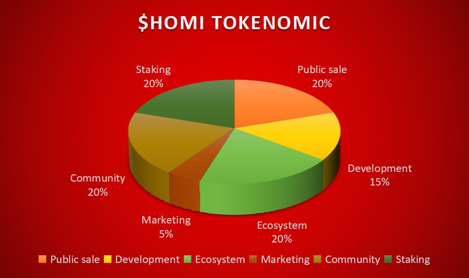
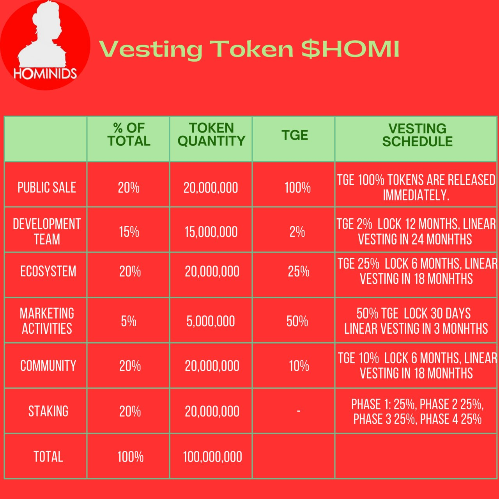

# 🔹Tokenomics

<figure><figcaption></figcaption></figure>

💎 **HOMI Token:** The vibrant heart of the Hominids project is the HOMI token. **With a total supply  of 100 million tokens (**~~**22 millions tokens**~~**) ,** HOMI is designed to be a strong and dynamic pillar of the ecosystem. It represents a valuable part in the growing Hominids community.

<figure><figcaption></figcaption></figure>

💼 **Conclusion:** Hominids Tokenomics is carefully designed to drive adoption, reward the community, and ensure sustainable ecosystem growth. We are committed to creating a dynamic economy where the value of the HOMI token grows as our platform and community expand.

🚀 Join us now to be at the heart of this revolution in the world of NFT and metaverses. As a **HOMI holder**, you are a key player in this exciting journey where innovation and creativity meet. Together, we are building the future of Hominids! 🚀
